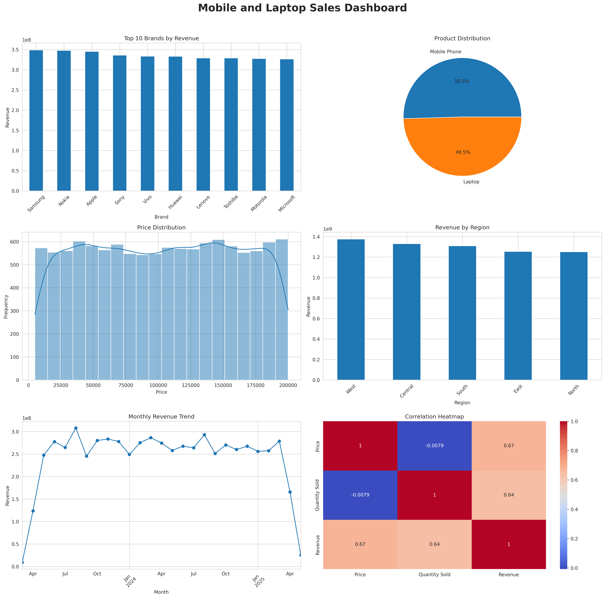

# Mobile Sales Analytics Dashboard

## Project Overview

This project was completed as part of my Data Science Internship at InternVision Tech.

The objective was to create a comprehensive sales dashboard that transforms raw sales data into meaningful business insights through data visualization, KPI analysis, and trend identification.

---

## Dataset

The dataset contains approximately 50,000 records related to mobile phones and laptops sales, including:

* Product
* Brand
* Price
* Quantity Sold
* Region
* Inward Date
* Dispatch Date
* RAM
* ROM
* SSD
* Processor Specifications

---

## Project Objectives

* Perform data cleaning and preprocessing
* Create KPI Cards
* Build business-oriented visualizations
* Identify sales trends and patterns
* Develop a complete dashboard for decision-making

---

## Technologies Used

* Python
* Pandas
* NumPy
* Matplotlib
* Seaborn
* Jupyter Notebook
* GitHub

---

## KPI Metrics

The dashboard includes:

* Total Revenue
* Total Units Sold
* Average Product Price
* Top Selling Brand

---

## Dashboard Components

### Visualizations

* Top 10 Brands by Revenue (Bar Chart)
* Product Distribution (Pie Chart)
* Price Distribution (Histogram)
* Revenue by Region (Bar Chart)
* Monthly Revenue Trend (Line Chart)
* Correlation Heatmap

---

## Dashboard Preview

### KPI Cards

### Sales Dashboard

---

## Business Insights

* Revenue performance was analyzed across multiple brands.
* Product distribution revealed sales patterns between laptops and mobile phones.
* Regional analysis identified top-performing sales regions.
* Monthly trend analysis highlighted revenue fluctuations over time.
* Correlation analysis revealed relationships between sales variables.

---

## Author

**Nazerke Supotaeva**

Data Science Intern

